# Node service && Module

## 零、主要内容

- Node服务器开发
- fs模块-文件系统
- event模块-事件处理
- 认识二进制和Buffer
- Buffer的创建方式
- Buffer的源码解析

## 一、服务器开发

### 1. Node.js是什么

### 2. Node.js 架构

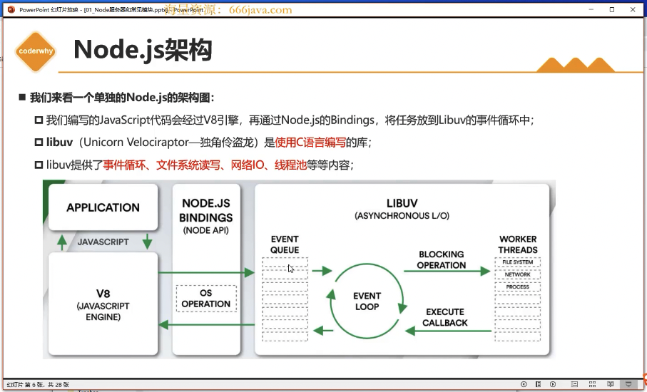

### 二、内置模块fs

- fs是File System的缩写，表示文件系统
- 对于任何一个为服务器端服务的语言或者框架通常都会有自己的文件系统

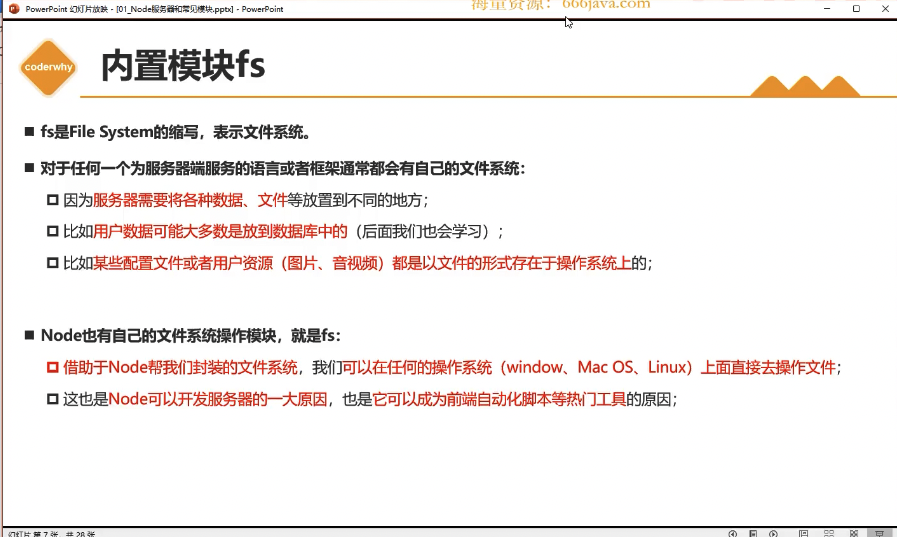

#### 1. fs的API介绍 - [官方API](https://nodejs.org/docs/latest-v20.x/api/fs.html)

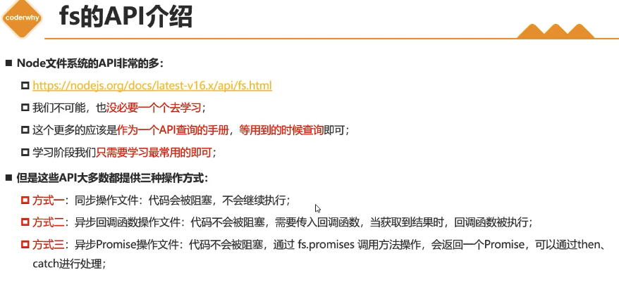

#### 2. 文件描述符

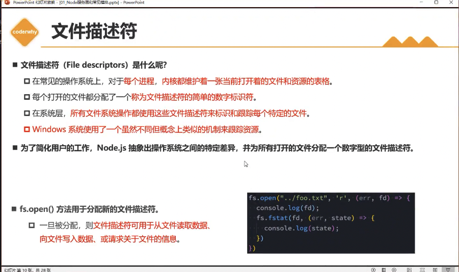

#### 3. 文件的读写 

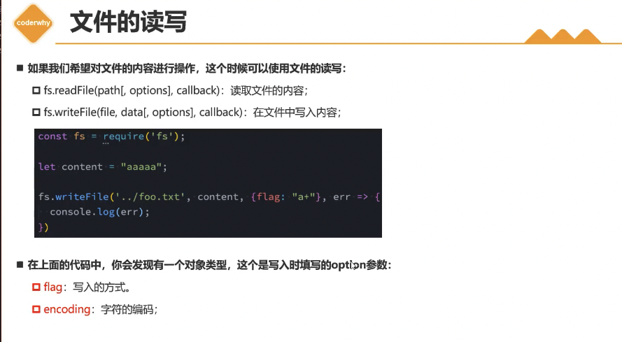

- flag 选项

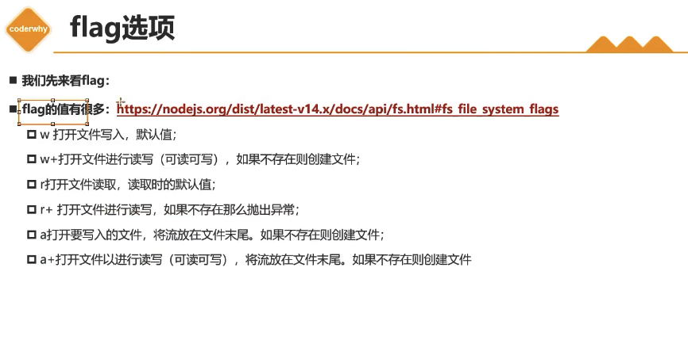

- encoding选项

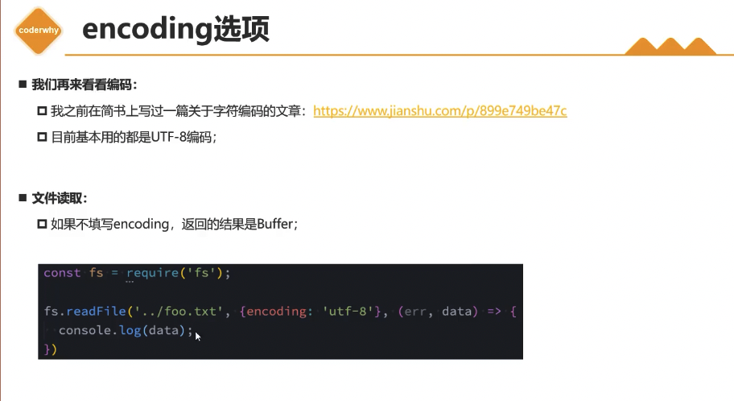

#### 4. 文件夹操作

- 新建文件夹
- 读取文件夹
- 重命名文件夹

### 二、内置模块events

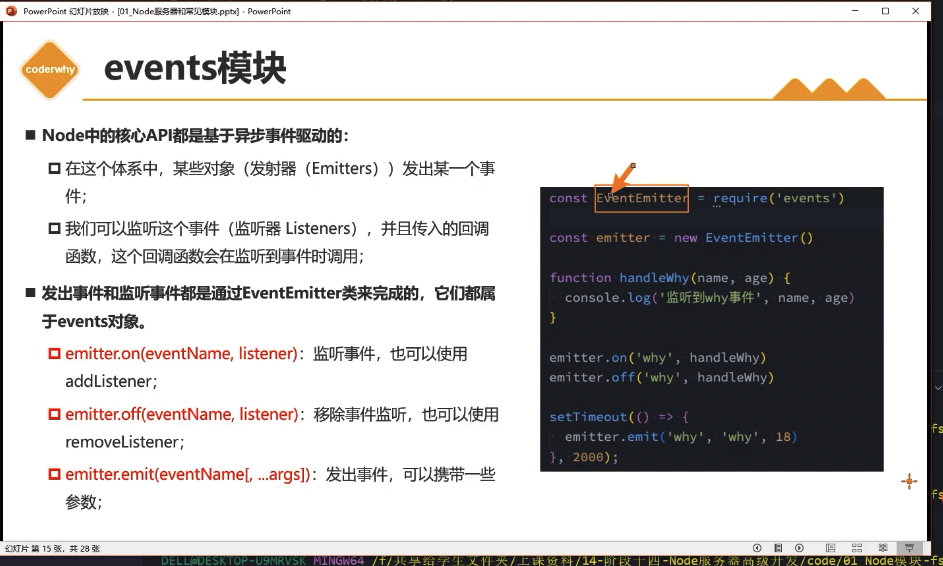

#### 1. 事件的监听

#### 2. 事件的取消

#### 3. 参数的传递

#### 4. 常见的方法

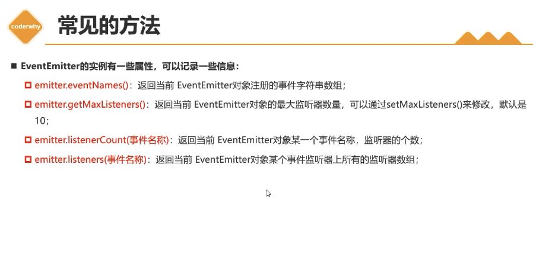

### 三、认识Buffer

#### 1. 数据的二进制

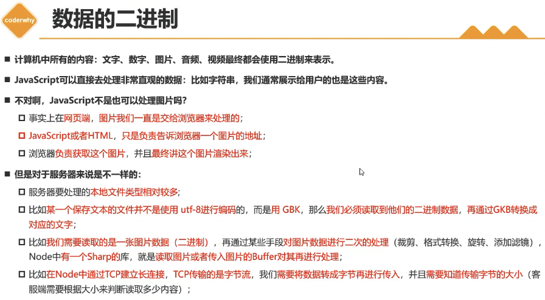

#### 2. Buffer和二进制

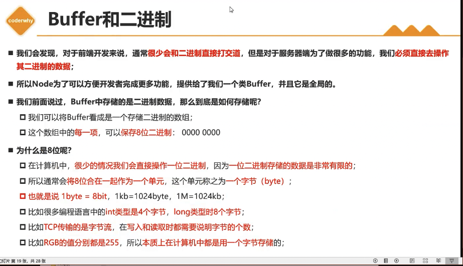

#### 3. Buffer的创建

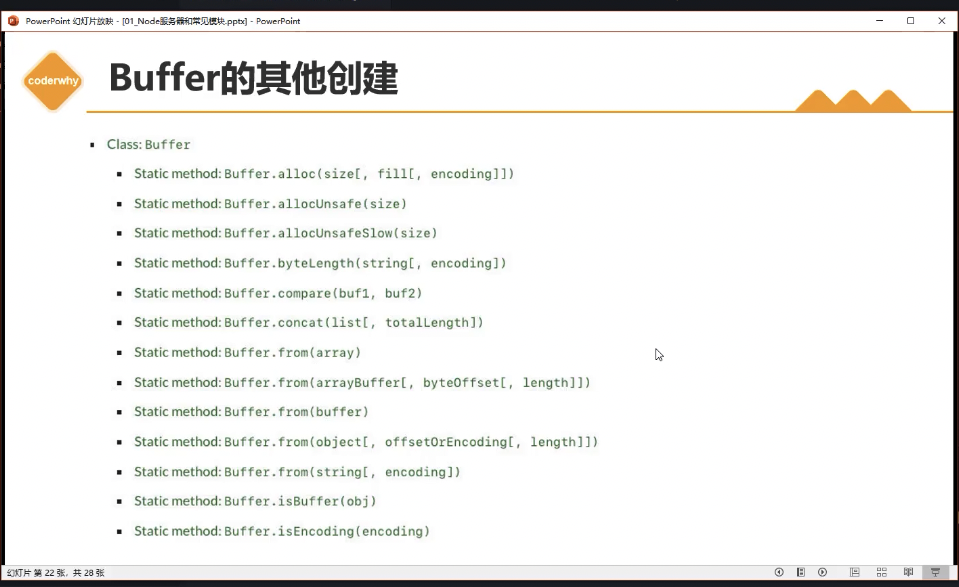
