# Web服务器开发和文件上传

## 零、主要内容

- Stream的读写操作
- http模块web服务
- request请求对象
- response响应对象
- axios node中使用
- 文件上传细节分析

## 一、Stream

### 1. 认识Stream

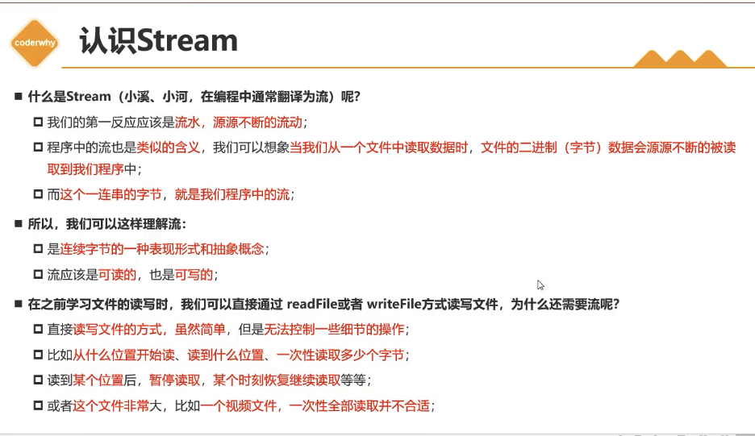

### 2. 文件读写的Stream

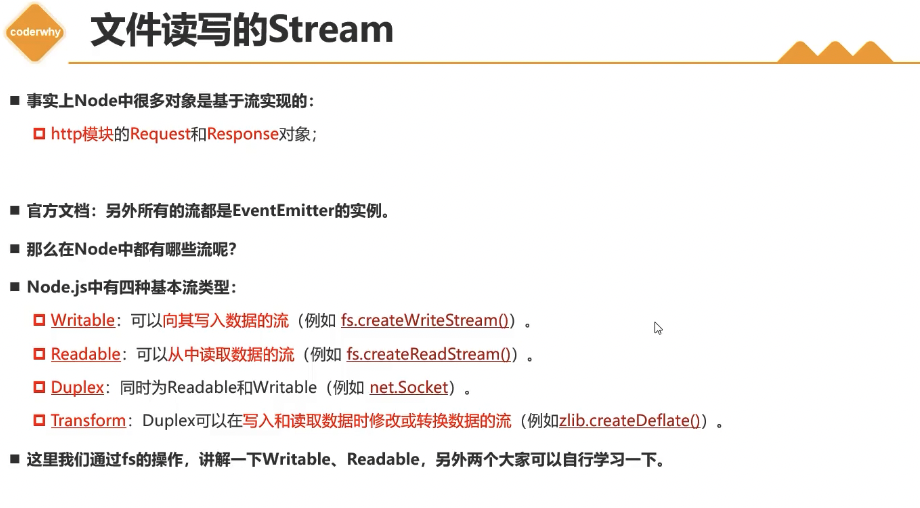

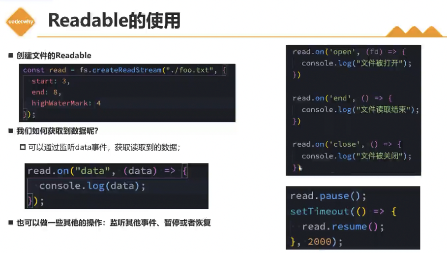

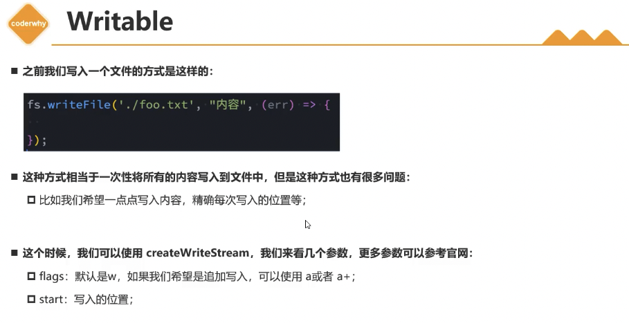

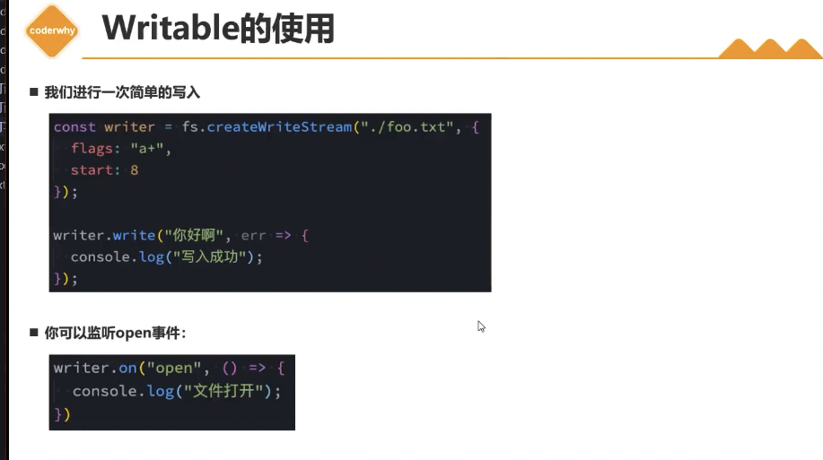

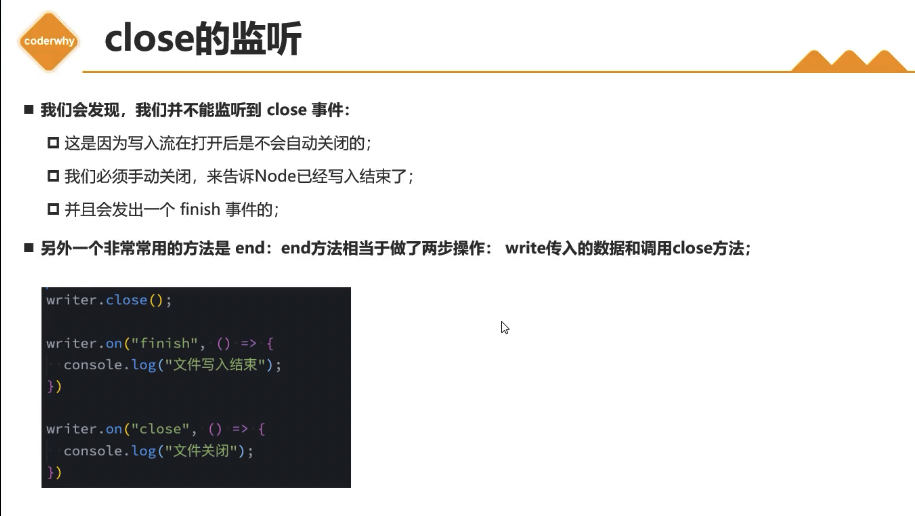

### 3. pipe方法

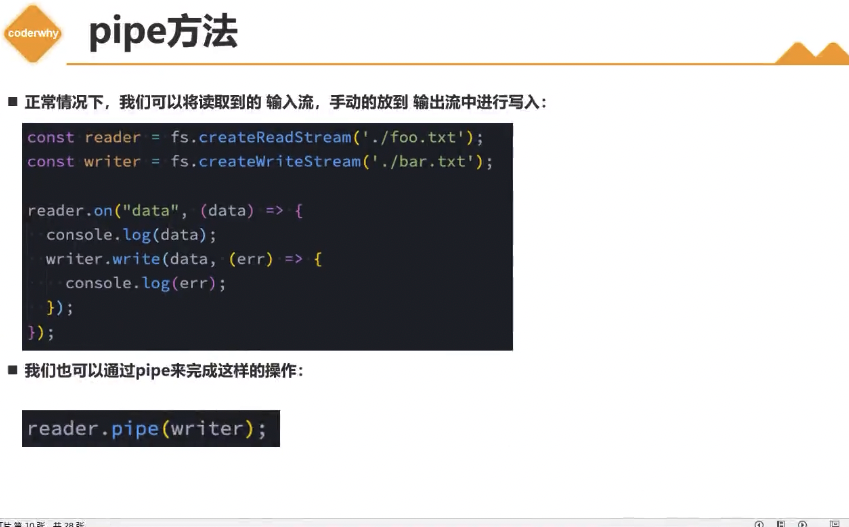

## 二、HTTP模块

### 1. Web服务器

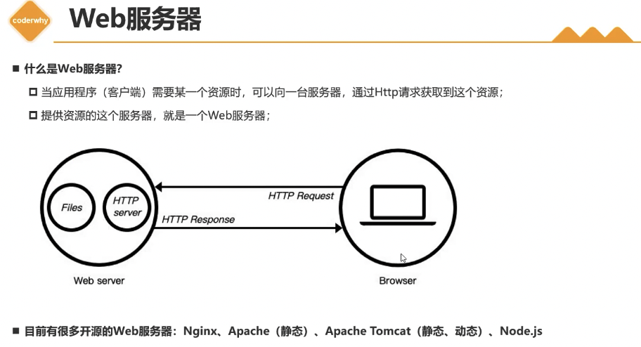

### 2. http模块

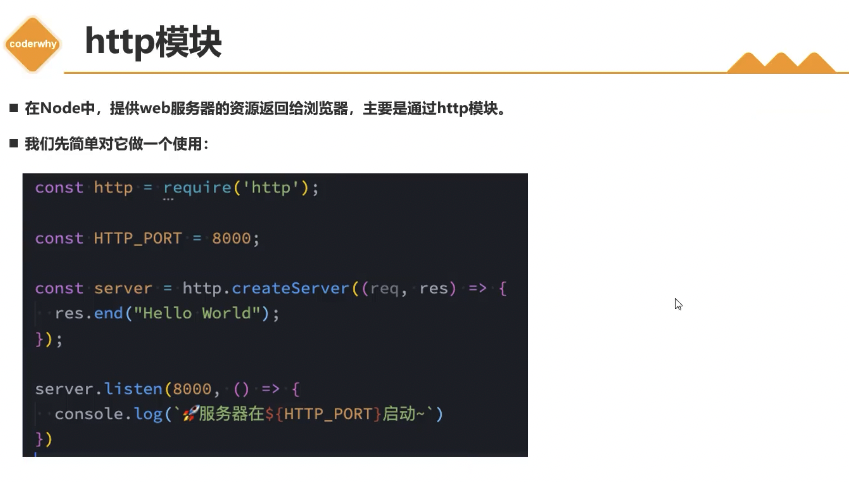

### 3. 创建服务器

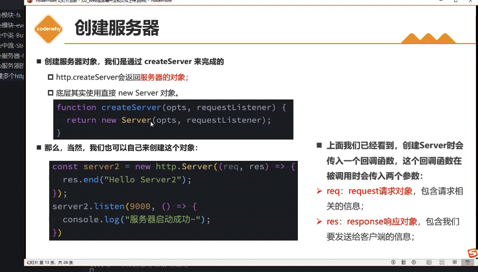

### 4. 监听主机和端口号

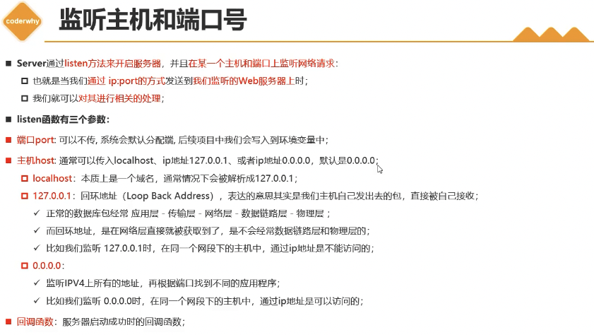

## 三、Request请求对象

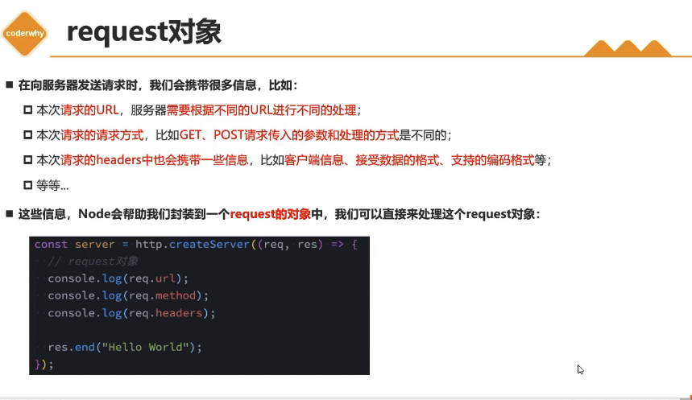

### 1. URL的处理

