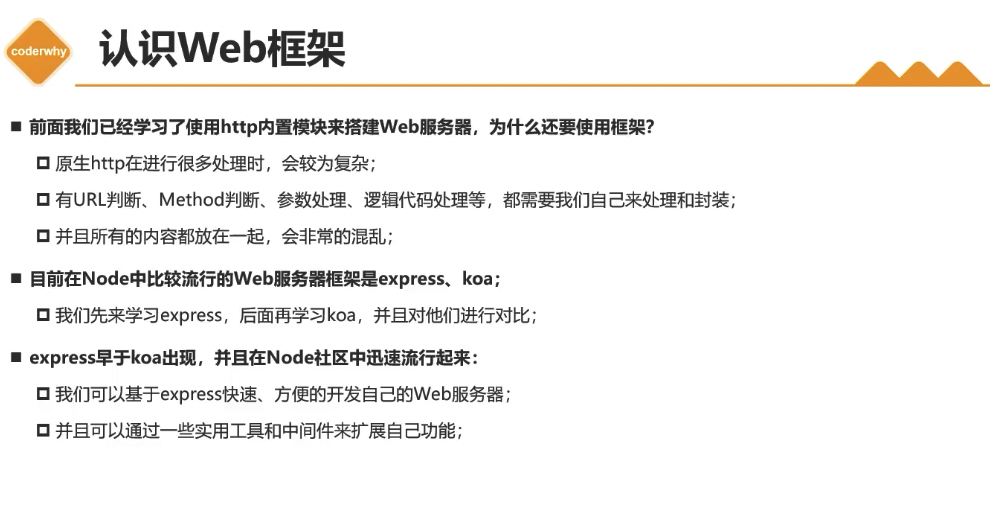
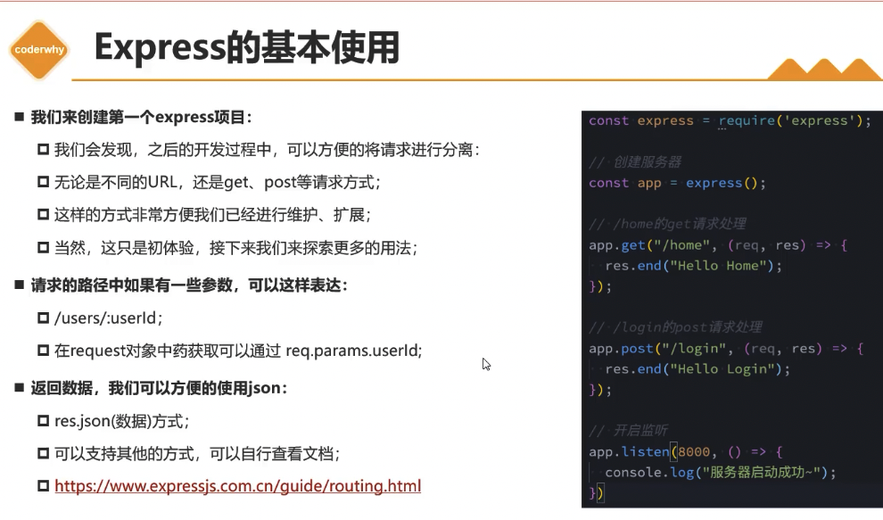

# Web框架 Express

## 零、主要内容

- Express认识初体验
- Express中间件使用
- Express请求和响应
- Express路由的使用
- Express的错误处理
- Express的源码解析

## 一、Express认识初体验

### 1. 认识Web框架



### 2. Express安装

- express的使用过程有两种方式
  - 方式一：通过express提供的脚手架，直接创建一个应用的骨架
  - 方式二：从零搭建自己的express应用结构

- 方式一：安装express-generator

```shell
  # 安装脚手架
  npm install express-generator -g
  # 创建项目
  express express-demo
  # 安装依赖
  npm install
  # 启动项目
  node bin/www
```

- 方式二：从零搭建自己的express应用结构

```shell
  # 创建项目
  mkdir express-demo
  # 初始化项目
  npm init -y
  # 安装express
  npm install express --save
  # 创建入口文件
  touch app.js
  # 启动项目
  node app.js
```

### 3. Express基本使用



## 二、Express中间件使用
