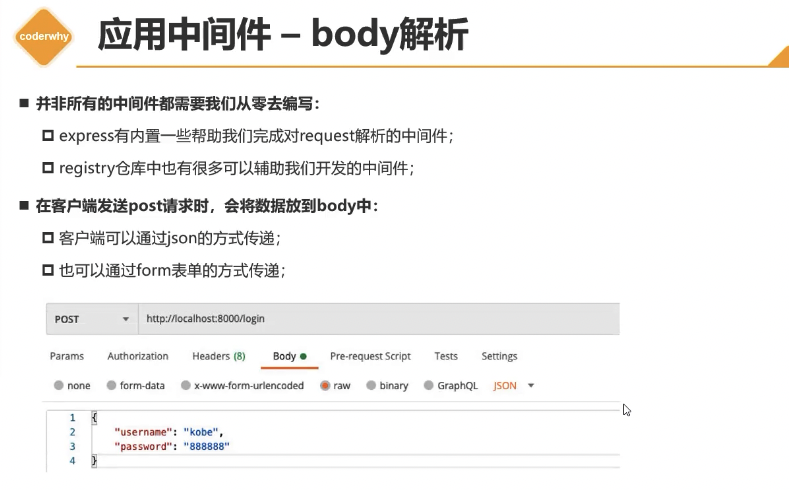
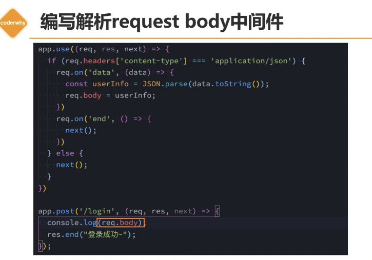
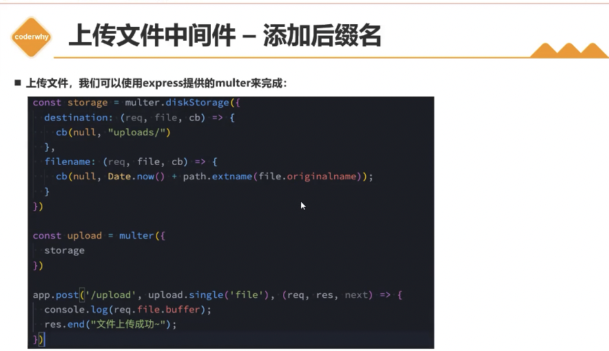
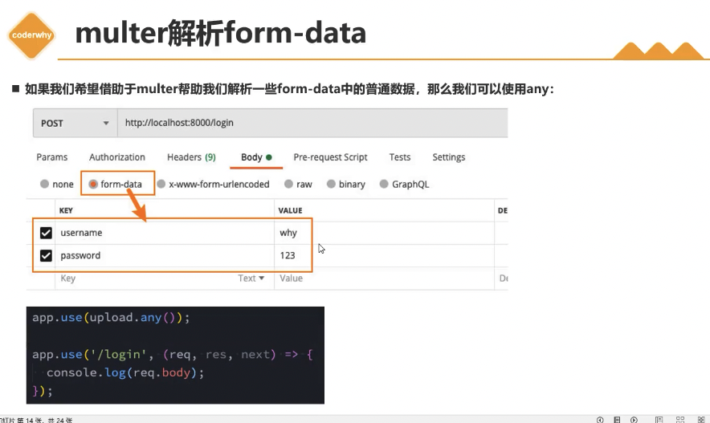
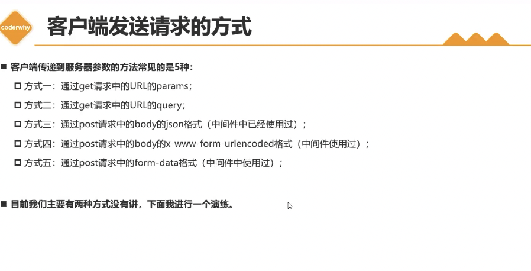
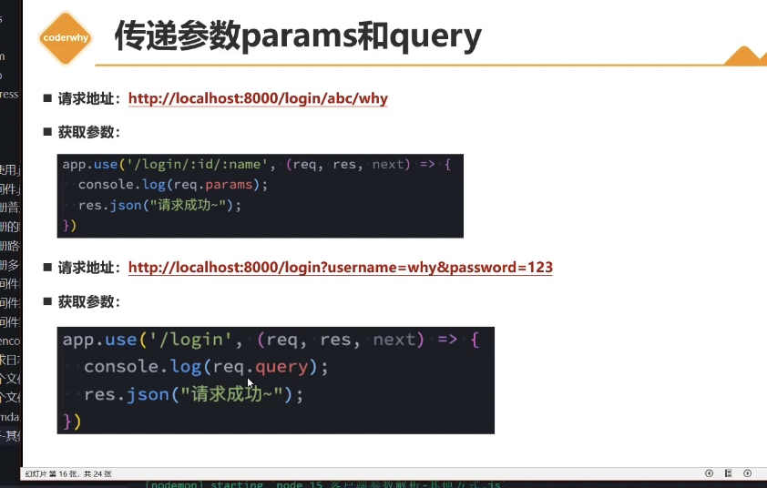
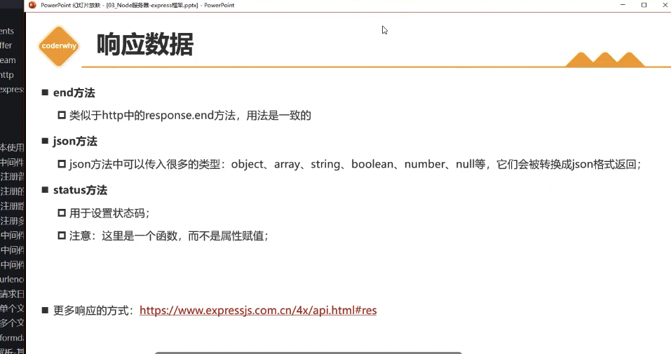

# Web框架 Express

## 零、主要内容

- Express认识初体验
- Express中间件使用
- Express请求和响应
- Express路由的使用
- Express的错误处理
- Express的源码解析

## 一、Express认识初体验

### 1. 认识Web框架


### 2. Express安装

- express的使用过程有两种方式
  - 方式一：通过express提供的脚手架，直接创建一个应用的骨架
  - 方式二：从零搭建自己的express应用结构

- 方式一：安装express-generator

```shell
  # 安装脚手架
  npm install express-generator -g
  # 创建项目
  express express-demo
  # 安装依赖
  npm install
  # 启动项目
  node bin/www
```

- 方式二：从零搭建自己的express应用结构

```shell
  # 创建项目
  mkdir express-demo
  # 初始化项目
  npm init -y
  # 安装express
  npm install express --save
  # 创建入口文件
  touch app.js
  # 启动项目
  node app.js
```

### 3. Express基本使用


## 二、Express中间件使用

- 根据express服务器创建的接口，请求时为什么会按照这种规则来匹配？ （中间件的匹配规则）

### 1. 认识中间件

- 中间件中可以执行哪些任务
  - 打印任何代码
  - 更改请求（request）和响应（response）对象
  - 结束请求-响应周期（返回数据）
  - 调用栈中的下一个中间件

- 如果当前中间件功能没有结束请求-响应周期，则必须调用next()将控制权传递给下一个中间件功能，否则请求将会被挂起

### 2. 应用中间件 - 编写

- 如何将一个中间件应用到我们的程序应用中
  - express主要提供了两种方式：
    - app/router.use
    - app/router.methods
  - 可以是app，也可以是router
  - methods指的是常用的请求方式，比如app.get app.post等

- use的用法，methods的方式本质是use的特殊情况
  - 案例一：最普通的中间件
  - 案例二：path匹配中间件
  - 案例三：path和method匹配中间件
  - 案例四：注册多个中间件

### 3. 应用中间件 - body解析





### 4. 应用中间件 - 第三方库

- 如果希望将请求日志记录下来，可以使用express官网开发的第三方库：morgan

```shell
  npm install morgan --save
```





### 5. 客户端发送请求的方式



#### 传递参数params和query



## 三、Express请求和响应


