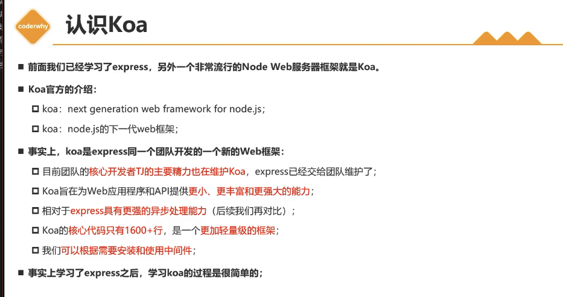

# Nodejs Web 框架 koa

## 零、主要内容

- koa的基本使用
- koa的参数解析
- koa响应和错误
- koa静态服务器
- koa的源码解析
- 和express对比

## 一、 koa的基本使用

### 1. 认识Koa

- node.js的下一代web框架

- koa是express同一个团队开发的一个新的Web框架
  - Koa旨在为Web应用程序和API提供更小，更丰富和更强大的能力
  - 相对于express具有更强的异步处理能力
  - Koa的核心代码只有1600+行，是一个更加轻量级的框架
  - 可以根据需要安装和使用中间件

