# MySQL 数据库 - 核心知识

## 零、主要内容

- MySQL介绍和安装
- MySQL连接和GUI
- SQL语句和数据类型
- SQL语句-DDL语句
- SQL语句-DML语句
- SQL语句-SQL语句

## 一、MySQL介绍和安装

### 1. 为什么需要数据库


### 2. 常见的数据库有那些


### 3. 认识MySQL

- 课程主要是开发自己的后端项目，以关系型数据MySQL作为主要内容
- MySQL的介绍
  - MySQL是一个关系型数据库，其本质上就是一款软件，一个系统

## 二、MySQL连接和GUI

### 1. MySQL的连接操作

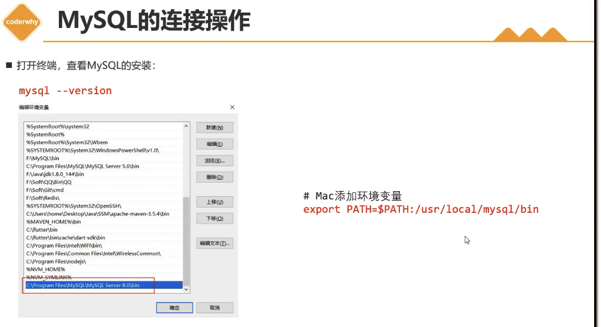

### 2. 终端连接数据库

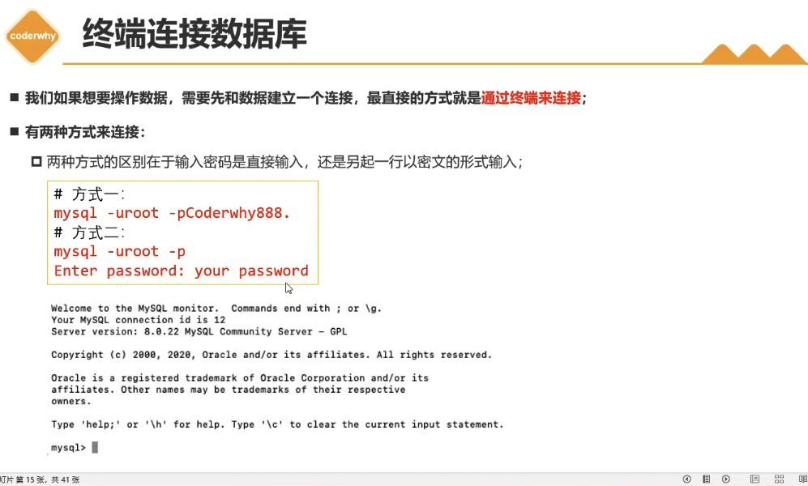

### 3. 终端操作数据 - 显示数据库

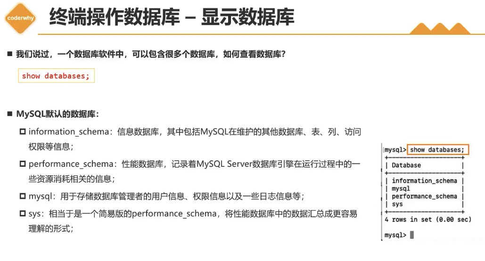

### 4. 终端操作数据 - 创建数据库-表

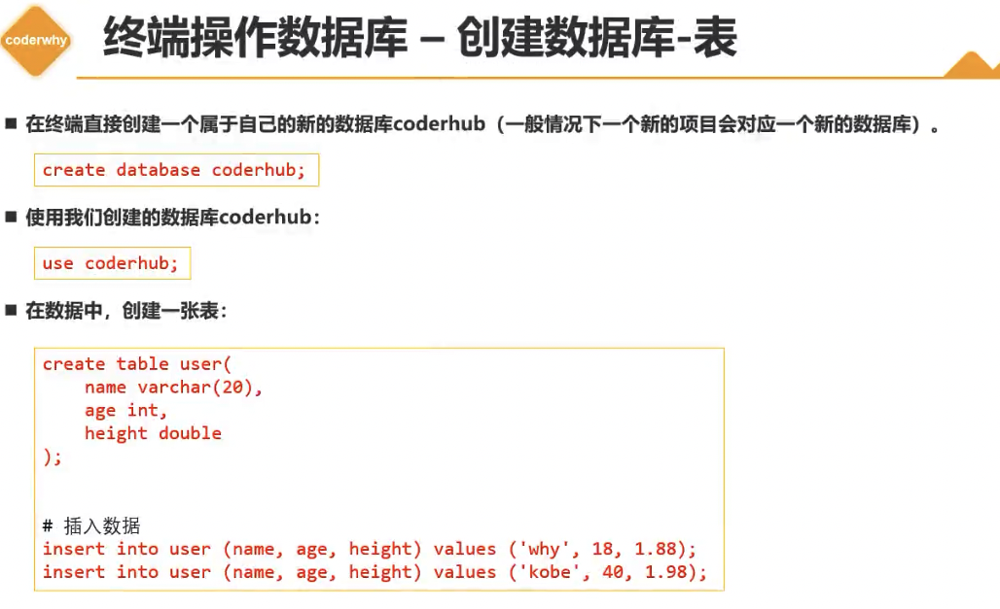

### 5. GUI工具介绍

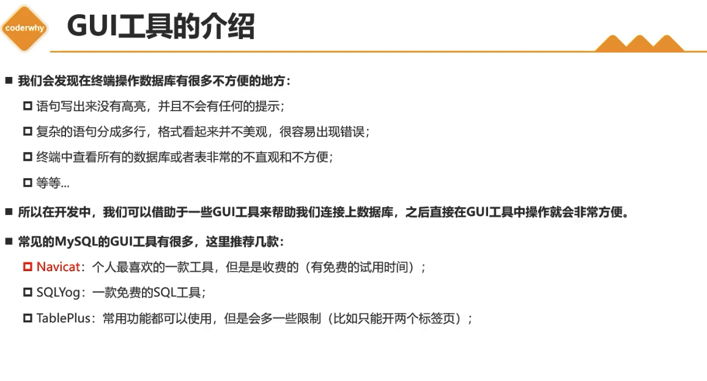

## 三、认识SQL语句

- 希望操作数据库，就需要有和数据库沟通的语言，这个语言就是SQL语句
  - SQL是

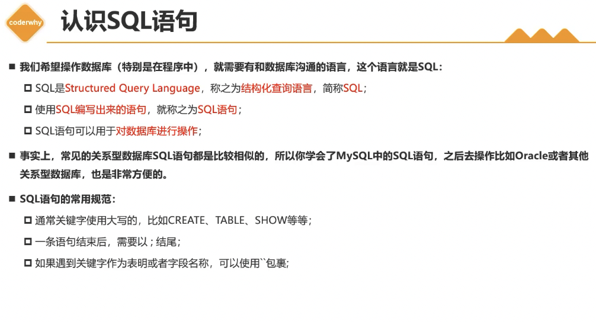

### 1. SQL语句的分类

- 常见的SQL语句可以分成四类：
  - DDL（Data Definition Language）：数据定义语言
    - 可以通过DDL语句对数据或者表进行：创建、删除、修改等操作
  - DML（Data Manipulation Language）：数据操作语言
    - 可以同构DML语句对表中的数据进行：添加、删除、修改等操作
  - DQL（Data Query Language）：数据查询语言
    - 可以通过DQL语句对数据进行查询**（重点）**
  - DCL（Data Control Language）：数据控制语言
    - 可以通过DCL语句对数据库、表格的权限进行相关访问控制操作

### 2. 数据库的操作（一）

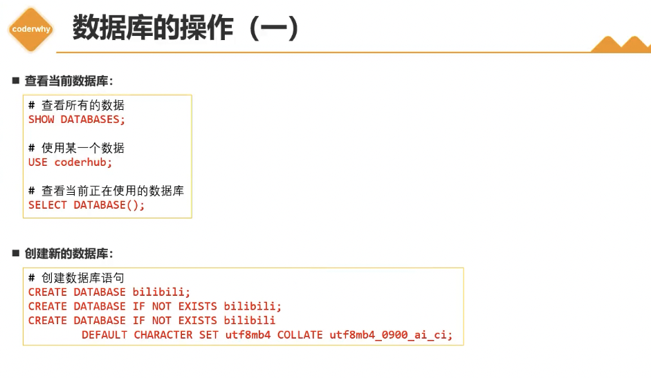

### 3. 数据库的操作（二）

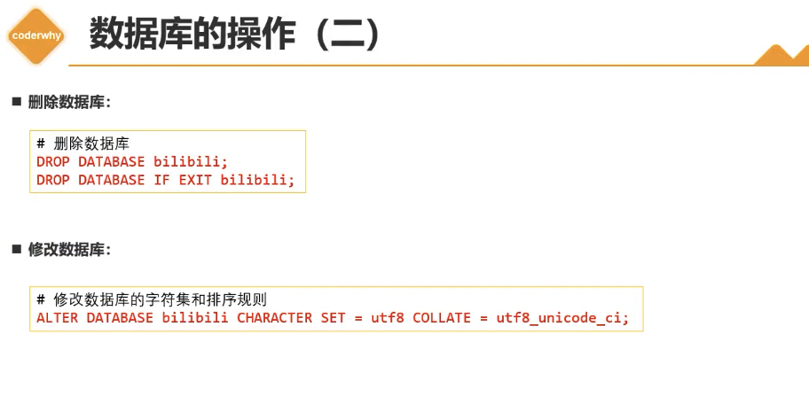

### 4. 数据表的操作

- 查看数据表

```sql
 # 查看所有的数据表
  SHOW TABLES;

 # 查看某一个表结构
  DESC 表名;
```

- 创建数据表

```sql
CREATE TABLE IF NOT EXISTS `users`(
  name varchar(20),
  age int,
  height float,
);
```

### 5. SQL的数据类型 - 数字类型

- MySQL支持的数据类型有：数字类型、日期和时间类型、字符串（字符和字节）类型，空间类型和JSON数据类型
- 数字类型
  - 整数类型
    - TINYINT：1个字节，范围-128~127
    - SMALLINT：2个字节，范围-32768~32767
    - MEDIUMINT：3个字节，范围-8388608~8388607
    - INT：4个字节，范围-2147483648~2147483647
    - BIGINT：8个字节，范围 -2^63 ~ 2^63-1
  - 浮点数类型
    - FLOAT(M,D)： 单精度浮点数，4个字节，M是总个数，D是小数点后面的个数
    - DOUBLE(M,D)：双精度浮点数，8个字节，M是总个数，D是小数点后面的个数
  - 精确数字类型：
    - DECIMAL(M,D)：高精度浮点数，M是总个数，D是小数点后面的个数
    - NUMERIC(M,D)：DECIMAL是NUMERIC的实现形式

- 日期类型
  - YEAR：年份类型，格式：YYYY，范围：1901~2155
  - DATE：日期类型，格式：YYYY-MM-DD，范围：1000-01-01 ~ 9999-12-31
  - DATETIME：日期和时间类型，格式：YYYY-MM-DD HH:MM:SS，范围：1000-01-01 00:00:00 ~ 9999-12-31 23:59:59
  - TIMESTAMP：时间戳类型，格式：YYYY-MM-DD HH:MM:SS，范围：1970-01-01 00:00:00 ~ 2038-01-19 03:14:07
  - TIME：时间类型，格式：HH:MM:SS

- 字符串类型
  - CHAR类型：在创建表时为固定长度，长度可以是0-255之间的任何值；在被查询时，会删除后面的空格
  - VARCHAR类型：在创建表时为可变长度，长度可以是0-65535之间的任何值；在被查询时，会保留后面的空格
  - BINARY和VARBINARY类型：用于存储二进制字符串类型，存储的是字符节字符串
  - BLOB类型：用于存储大的二进制类型
  - TEXT类型：用于存储大的字符串类型

### 6. 表约束

- 主键：PRIMARY KEY
  - 一张表中，为了区分每一条记录的唯一性，必须有一个字段是永远不会重复的，并且不会为空的，这个字段通常将他设置为主键
    - 主键是表中唯一的索引
    - 并且必须是NOT NULL的，如果没有设置NOT NULL，那么MySQL也会隐式的设置为NOT NULL
    - 主键也可以是多列索引，PRIMARY KEY（key_part,...），称之为联合主键
    - 建议：开发中主键字段应该是和业务无关的，尽量不要使用业务字段来作为主键

- 唯一键：UNIQUE KEY
  - 某些字段在开发中希望是唯一的，不会重复的，比如手机号码、身份证号码等，这个字段可以使用UNIQUE来约束
  - 使用UNIQUE约束的字段在表中必须是不同的
  - UNIQUE索引运行NULL包含的列具有多个值NULL

- 不能为空：NOT NULL
  - 某些字段要求用户必须插入值，不可以为空，可以使用NOT NULL约束

- 默认值：DEFAULT
  - 某些字段希望在没有设置值时给予一个默认值，这个时候可以使用DEFAULT来完成

- 自动递增：AUTO_INCREMENT
  - 某些字段希望不设置值时可以自动递增，这个时候可以使用AUTO_INCREMENT来完成
  - AUTO_INCREMENT的值必须是整数类型，通常是INT类型
  - AUTO_INCREMENT的值默认是从1开始的，每次递增1
  - AUTO_INCREMENT的值在表中是唯一的
  - AUTO_INCREMENT的值在表中是不可修改的
  - AUTO_INCREMENT的值在表中是不会重复的

- 外键约束 - 讲到多表关系时，在进行讲解

## 四、SQL语句-DDL语句

### 1. 数据库操作

```sql
-- 对数据库进行操作
-- 1. 查看当前所有的数据库
SHOW  DATABASES;

-- 2. 使用某个数据库
USE music_db;

-- 3. 查看目前哪一个数据库选中（正在使用的数据库）
SELECT DATABASE();

-- 4. 创建一个新的数据库
CREATE DATABASE IF NOT EXISTS test_demo;

-- 5. 删除某一个数据库
DROP DATABASE IF EXISTS  test_demo;

-- 6. 修改数据库（了解， 自己演练）
```

### 2. 数据表操作

```sql
-- 1. 查看当前数据库中有哪些表
SHOW TABLES;

-- 2. 查看某一张表的表结构
DESC t_singer;

-- 3. 创建一张新表
-- 3.1 创建基本表结构
CREATE TABLE IF NOT EXISTS `users`(
  name VARCHAR(10),
  age INT,
  height DOUBLE
);

DROP TABLE IF EXISTS `users`

-- 3.2 创建完整表结构
CREATE TABLE IF NOT EXISTS `users`(
  id INT PRIMARY KEY AUTO_INCREMENT,
  name VARCHAR(20) UNIQUE NOT NULL,
  level INT DEFAULT(0),
  telephone VARCHAR(20) UNIQUE
);

-- 4. 修改表结构
-- 4.1 修改表名字
ALTER TABLE `users` RENAME TO `t_users`;
-- 4.2 添加新的字段（field）
ALTER TABLE `t_users` ADD `createTime` TIMESTAMP;
-- 4.3 修改字段的名称（field名称）
ALTER TABLE `t_users` CHANGE createTime createAt DATETIME;
-- 4.4 删除某一个字段（field）
ALTER TABLE `t_users` DROP createTime;
-- 4.5 修改某一个字段类型（id int -> bigint）
ALTER TABLE `t_users` MODIFY `id` BIGINT;
```

## 五、SQL语句-DML语句

### 1. 删除操作 - 更新操作

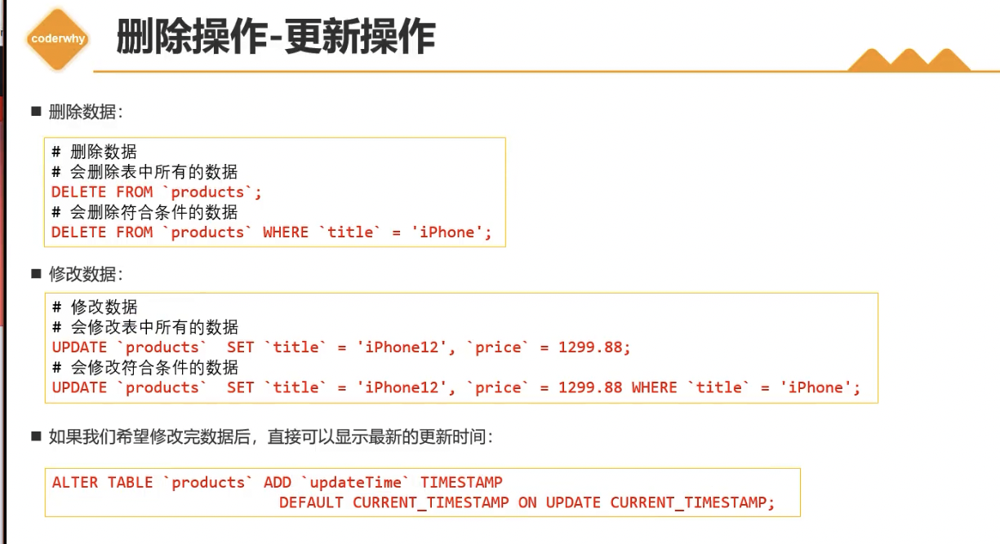

## 六、SQL语句-DQL语句

- DQL：Data Query Language，数据查询语言
  - SELECT用于从一个或者多个表中检索选中的行（Record）

- 查询的格式如下

```sql
SELECT select expr [,select expr]...
  [FROM table_references]
  [WHERE where_condition]
  [ORDER BY expr [ASC | DESC]]
  [LIMIT {[offset,]row_count | row_count OFFSET offset}]
  [GROUP BY expr]
  [HAVING having_condition]
  
```

### 1. 准备数据

- 准备一张表

```sql
CREATE TABLE IF NOT EXISTS `products`(
  id INT PRIMARY KEY AUTO_INCREMENT,
  brand VARCHAR(20) ,
  title VARCHAR(100) NOT NULL,
  price DOUBLE NOT NULL,
  score DECIMAL(2,1),
  voteCnt INT,
  url VARCHAR(100),
  pid INT,
);
```

### 2. 基本查询

- 查询所有的字段

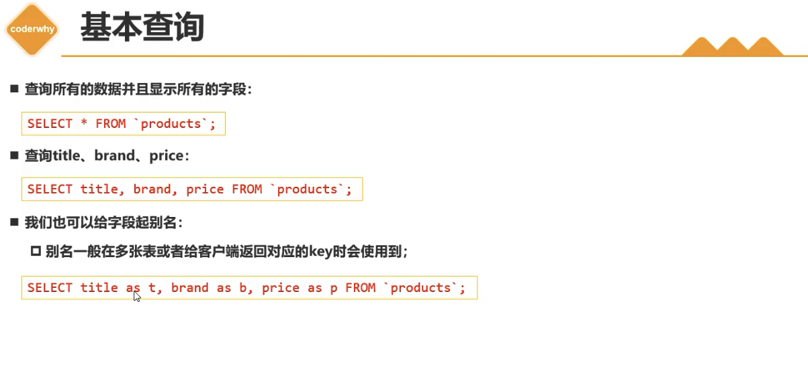

### 3. while查询条件（一）

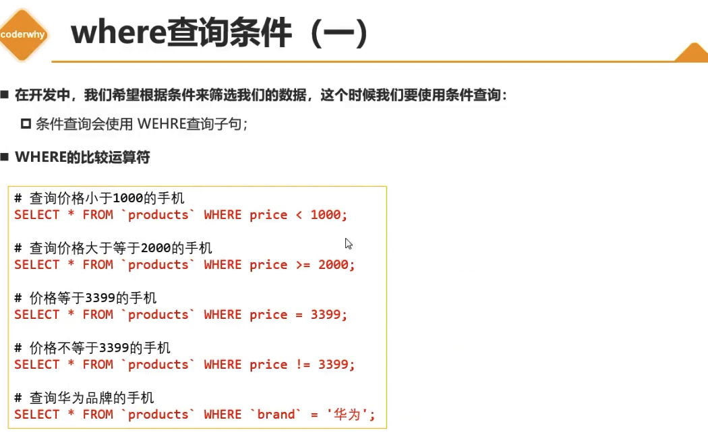

### 4. while查询条件（二）

- WHERE的逻辑运算符

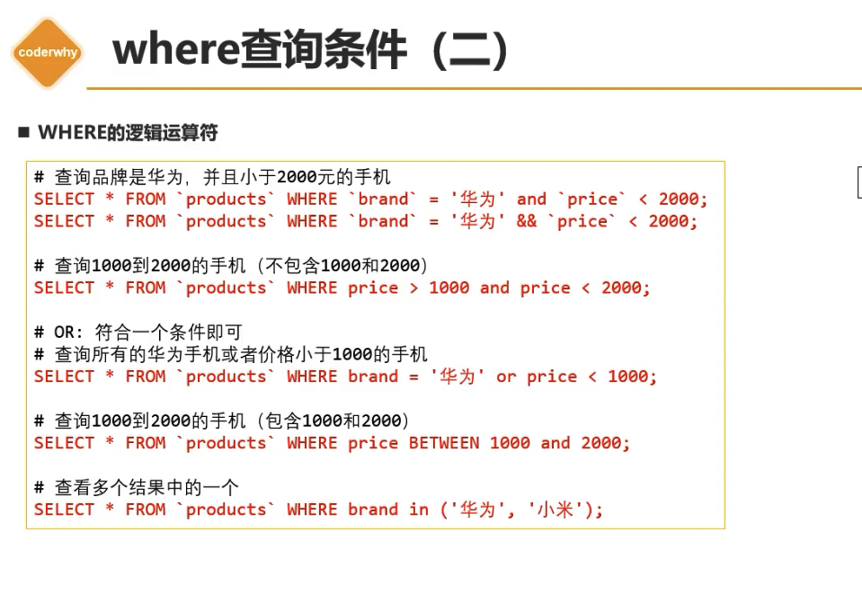

### 5. while查询条件（三）

- WHERE的逻辑运算符

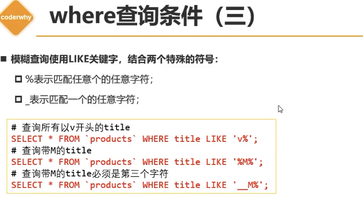

### 6. 查询结果排序

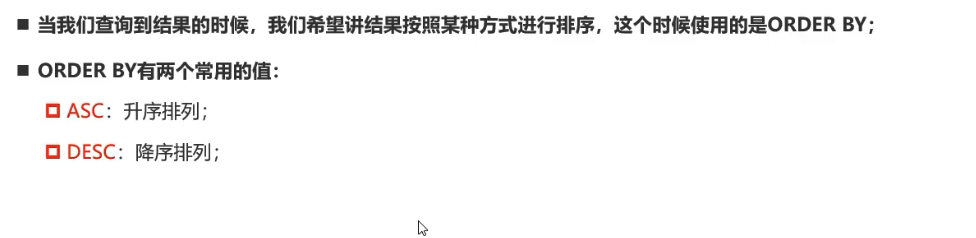

### 7. 查询结果分页

- 当数据库中的数据非常多时，一次性查询到所有的结果进行显示不太现实：
  - 真实开发中，都会要求用户传入offset、limit或者page等字段
  - 目的是可以在数据库中进行分页查询
  - 用法有：[LIMIT {[offset,] row_count | row_count OFFSET offset}]

### 8. 聚合函数

- 聚合函数表示对 值的集合 进行操作的 组（集合）函数

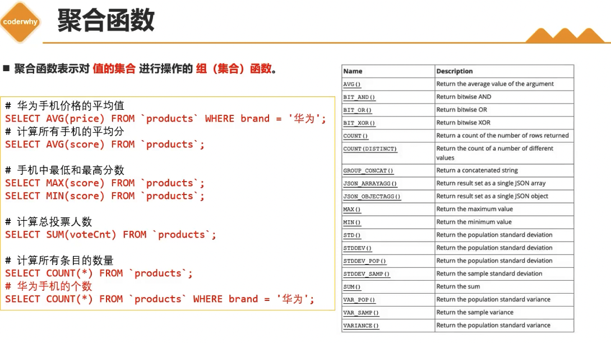

### 9. 认识 GROUP BY

- 事实上聚合函数相当于默认将所有的数据分成了一组
  - 前面使用avg、max等，都是将所有的结果看成了一组来计算
  - 如何希望划分多个组：比如按照品牌来划分
  - 可以使用 GROUP BY

- GROUP BY通常和聚合函数一起使用
  - 表示先对数据进行分组，在对每一组数据，进行聚合函数的计算

- 需求：
  - 根据品牌进行分组
  - 计算每个品牌中：商品的个数、平均价格
  - 也包括：最高价格、最低价格、平均评分

- 可以使用 HAVING 对GROUP BY查询到的结果添加约束条件
  - HAVING的使用和WHERE类似，但是HAVING是对GROUP BY查询到的结果进行约束
  - 例：希望筛选出平均价格在4000以下，且平均分在7以上的品牌

```sql
 SELECT 
  brand, MAX(price) maxPrice, MIN(price) minPrice, ROUND(AVG(price), 2) avgPrice, AVG(score) avgScore
FROM `products` 
GROUP BY brand
HAVING avgStore > 7 AND avgPrice > 4000;
```

### 10. 创建多张表

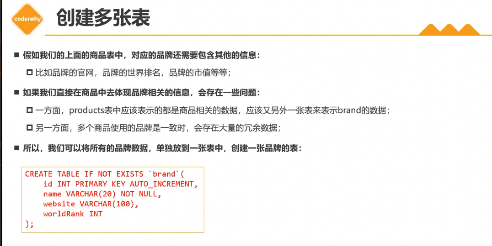

### 11. 创建外键

- 将两张表联系起来，可以将products中的brand_id关联到brands中的id上

```sql
 # 如果是创建表添加外键约束，需要在创建的()最后添加以下语句：
 FOREIGN KEY(brand_id) REFERENCES brands(id)

 # 如何表已经创建好，额外添加外键
 ALTER TABLE `products` Add `brandId` INT;
 ALTER TABLE products ADD FOREIGN KEY(brand_id) REFERENCES brands(id)
```
  
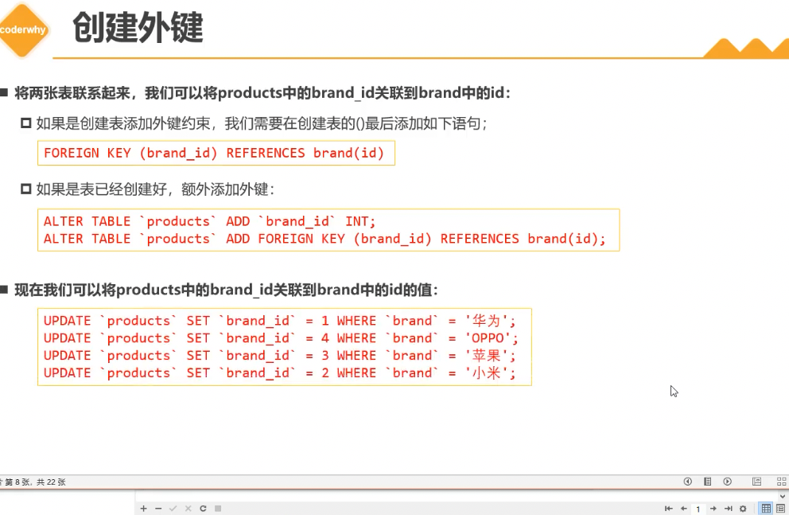

#### 1. 外键存在时更新和删除数据

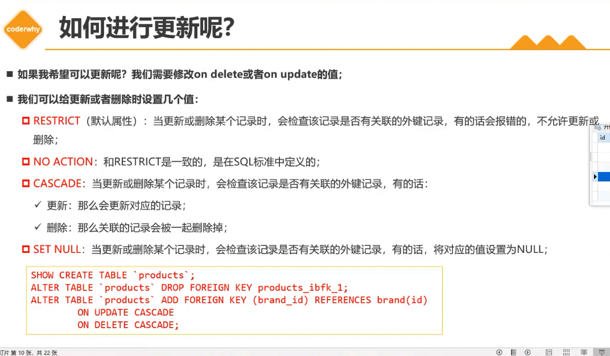

希望可以更新，如何进行修改？

- 需要修改 on update 或者 on delete的值
- 给更新或者删除时设置几个值
  - RESTRICT：默认值，当更新或删除某个记录时，会检查该记录是否有关联的外键记录，有的话会报错，不允许更新或删除。
  - NO ACTION：和RESTRICT类似，是在SQL标准中定义的。
  - CASCADE：当更新或删除某个记录时，会同时更新或删除有关联的外键记录。
  - SET NULL：当更新或删除某个记录时，会将有关联的外键记录的外键字段设置为NULL。

### 12. 多表查询

- 希望查询到产品的同时，显示对应的品牌相关的信息，由于数据是存放在两个表中，此时需要进行多表查询
- 如何直接通过查询语句在多张表中查询，是什么效果呢？
  - 会将两张表中的所有数据进行笛卡尔积的组合，然后再进行筛选

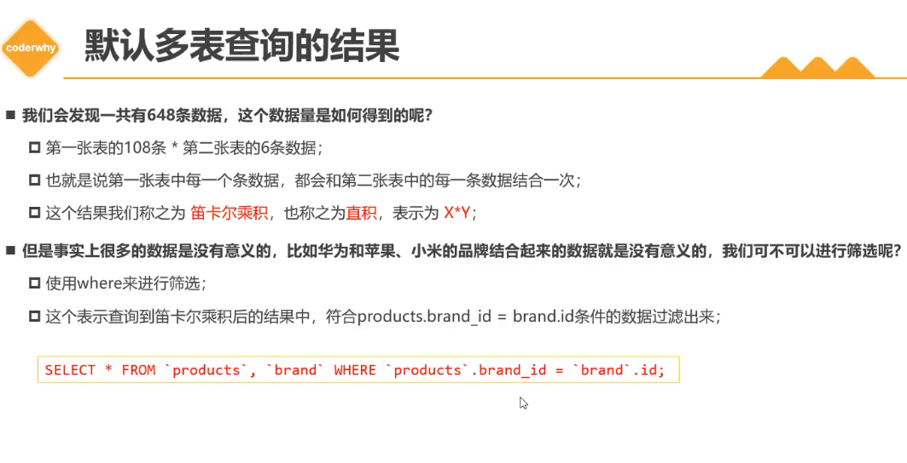

#### 1. 多表之间的连接

- 事实上上面默认的查询效果并不是这样的，而且表中的某些特定数据查询不到，可以使用`SQL JOIN`操作
  - 左连接
  - 右连接
  - 内连接
  - 全连接

#### 2. 左连接

- 希望获取到的是左边所有的数据（以坐标为主）
  - 这个时候就表示无论坐标的表是否有对应的brandId的值对应右边表的id，坐标的数据都会被查询出来。
  - 这也是开发中使用最多的情况，完整写法是 `LEFT [OUTER] JOIN`，通常OUTER可以省略

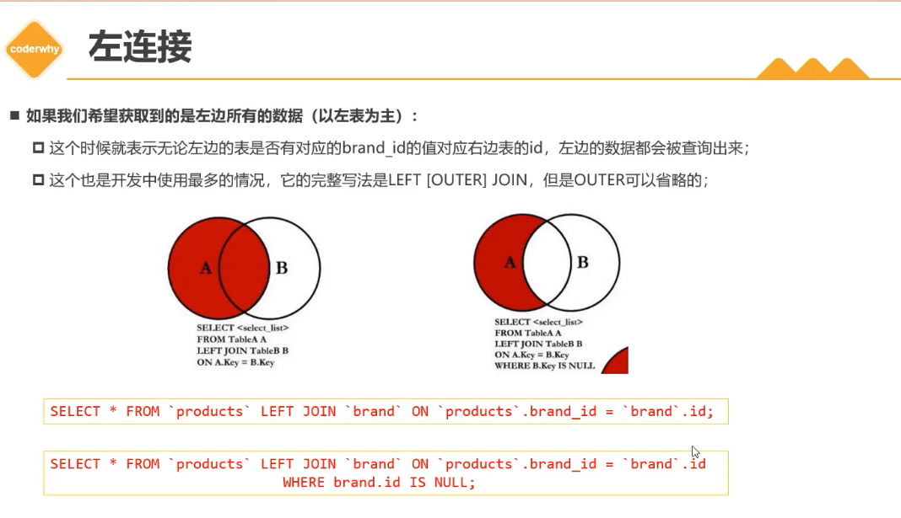

#### 3. 右连接

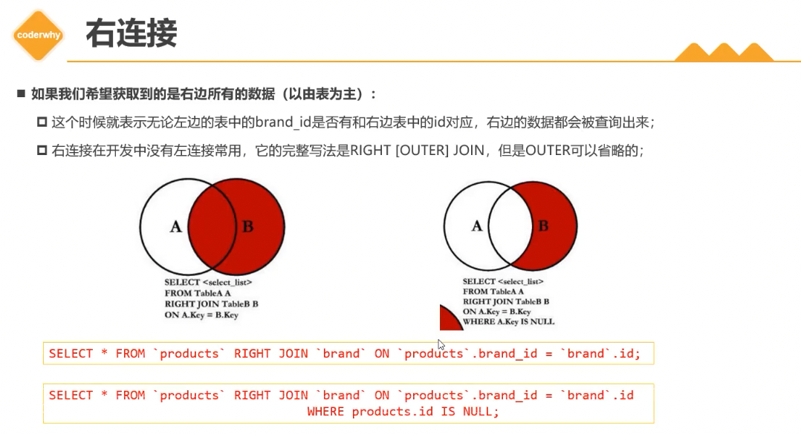

#### 4. 内连接

- 事实上内连接是表示左边的表和右边的表都有对应的数据关联
  - 内连接在开发中偶尔会使用
  - 内连接有其他的写法： `[CROSS/INNER] JOIN`或者`JOIN`都可以

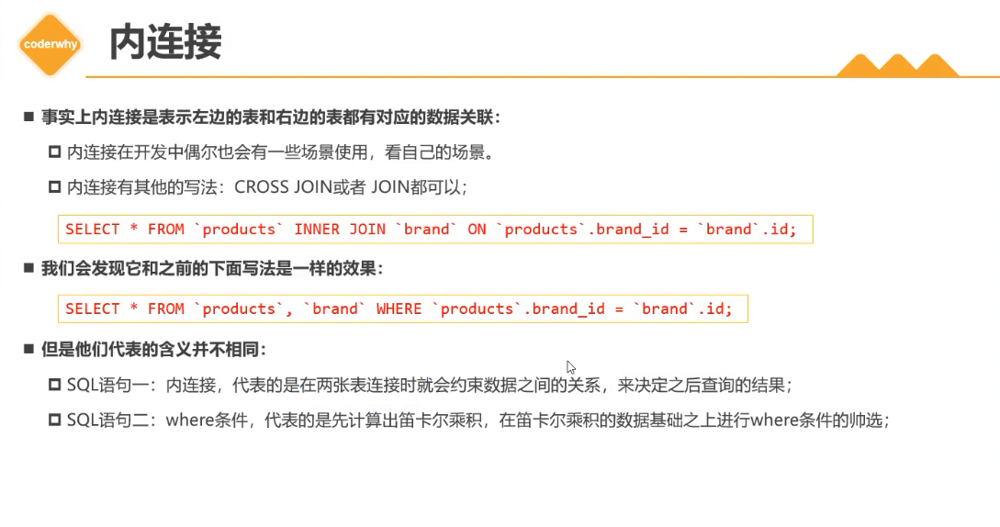

#### 5. 全连接

- SQL规范中全连接是使用FULL JOIN，但是MySQL中并没有对它的支持，需要使用UNION来完成

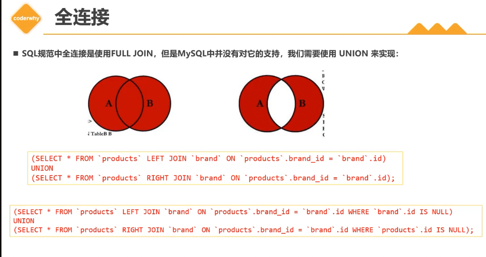

### 11. 多表查询

#### 1. 多对多关系数据准备

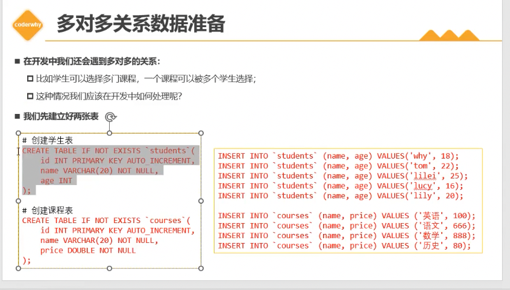

#### 2. 创建关系表

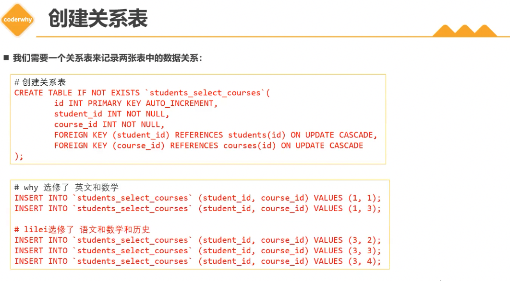

#### 3. 查询多对多数据

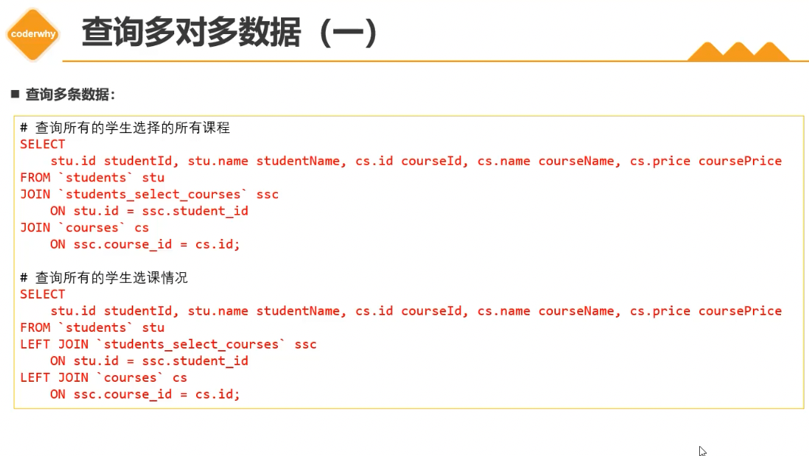

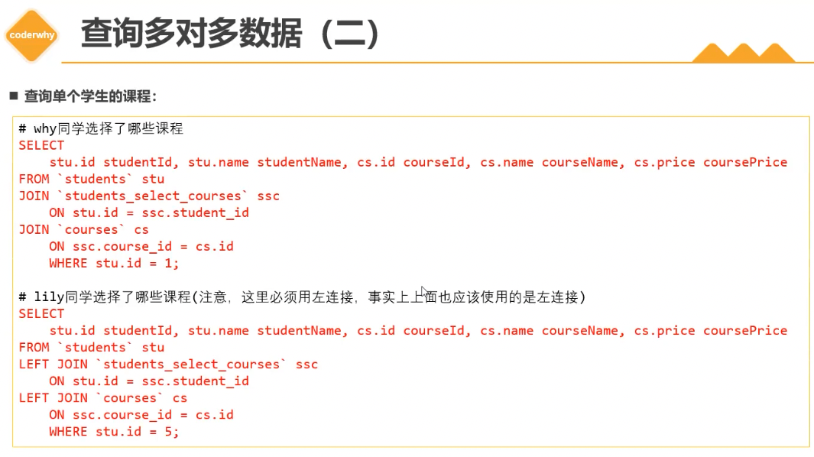
