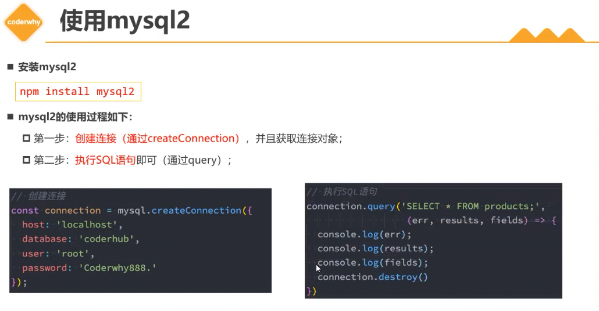
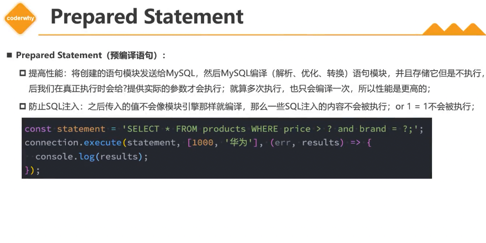

# MySQL数据库 - node使用

## 零、主要内容

- MySQL查询对象
- MySQL查询数组
- mysql2库介绍使用
- mysql2预处理语句
- mysql2连接池使用
- mysql2的Promise

## 一、MySQL查询对象

### 1. 查询数据的问题

- 前面的学习的查询语句中，查询到的结果通常是一张表，比如查询手机+品牌信息

```sql
SELECT * FROM `products` LEFT JOIN brands ON products.brandId = brands.id;
```

### 2. 将brand转成对象

- 在实际开发中，品牌信息部分应该放入到一个对象中，而不是一张表中

```sql
SELECT 
  products.id as id, products.title as title, products.price as price,
  JSON_OBJECT('id',brands.id, 'name',brands.`name`, 'website',brands.website, 'rank', brands.worldRank) as brand
FROM `products` LEFT JOIN brands ON products.brandId = brands.id;
```

### 3. 多对多转成数组

- 在多对多关系中，希望查询到的是一个数组
  - 比如一个学生的多门课程信息，应该放到一个数组中
  - 数组中存放的是课程信息的一个个对象
  - 要结合JSON——ARRAYAGG函数和JSON_OBJECT函数

## 二、 认识mysql2

- 前面的操作都是在GUI工具中，通过执行SQL语句来获取结果的，真实开发中是通过代码来完成所有操作的
- 如何在Node的代码中执行SQL语句来，可以借助于两个库：
  - mysql：最早的Node连接MySQL的数据库驱动
  - mysql2：在mysql基础上，进行了很多优化、改进

- mysql2兼容mysql的API，并且提供了一些附加功能
  - 更快/更好的性能
  - Prepared Statement（预编译语句）：
    - 提高性能：
    - 防止SQL注入
  - 支持Promise

### 1. 使用mysql2



### 2. Prepared Statement

- Prepared Statement（预编译语句）：
  - 提高性能：将创建的语句模块发送给MySQL，然后MySQL编译（解析、优化、转换）语句模块，并且存储它但是不执行，之后在真正执行是会给？提供实际的参数才会执行；就算多次执行，也只会编译一次
  - 防止SQL注入



### 3. Connection Pools

- 前面是创建了一个连接（connection），但是如果有很多个请求的话，该连接可能正在被占用，这时候就需要创建多个连接，这就是连接池
  - mysql2提供了连接池的功能
  - 连接池可以在需要的时候自动创建连接，并且创建的连接不会被销毁，会放到连接池中，后续可以继续使用
  - 可以在创建连接池的时候设置LIMIT，即最大创建的连接数
